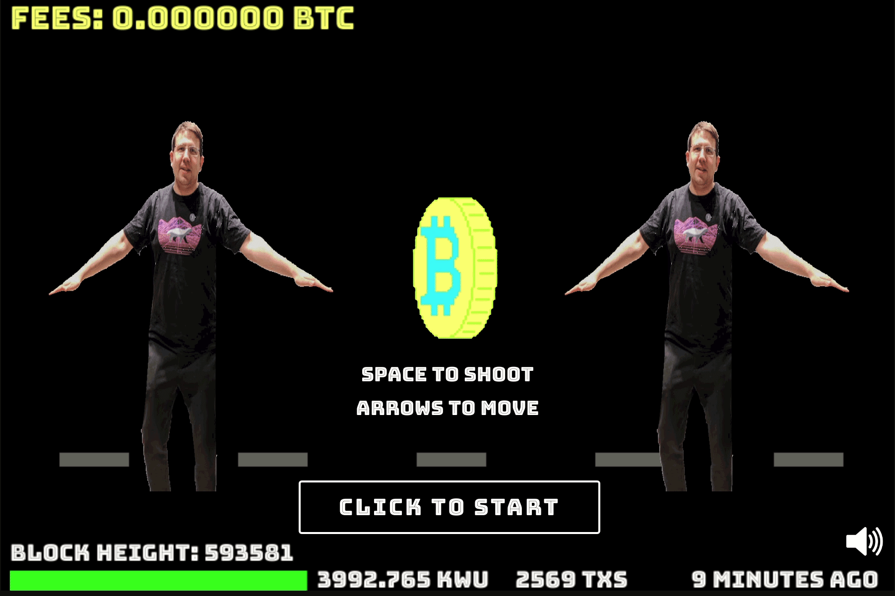

## Block Invaders | Bitcoin Blocks Space Invaders

### Designed @ Tel Aviv Bitcoin emBassy Hackathon 2019
A web-based, static version of the classic Arcade game: Space Invaders.
Each level is fully dependant on the current block in Bitcoin's Blockchain. 

Use the arrow keys to move and the space bar to shoot
Every once in a while, a COINBASE will spawn. If you manage to shoot it down, you may receive a power up item! These power up items can upgrade your weapons or boost speed. Be sure to pick these up quickly because they will disappear!

[Click here to Play Block Invaders](https://alon-e.github.io/block-invaders/)

